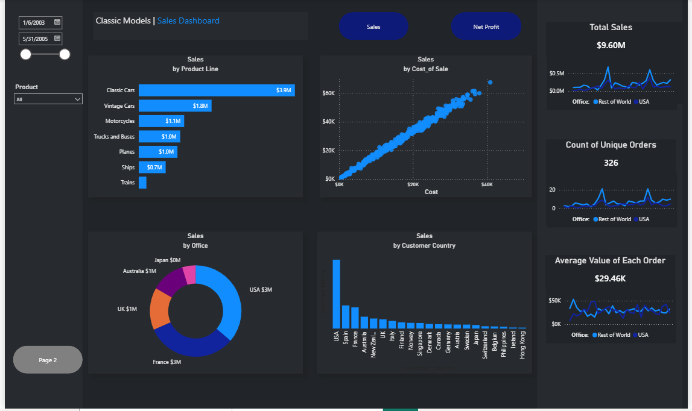
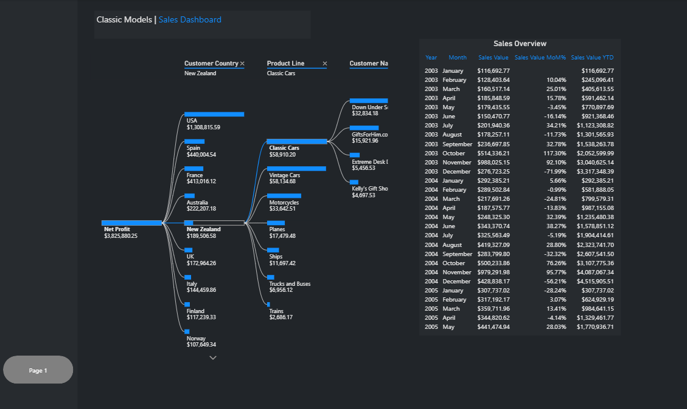

# 📊 Classic Models Sales Dashboard (Power BI)

## 📌 Project Overview

This project presents an interactive Power BI dashboard built using the Classic Models sales dataset. The dashboard provides insights into sales performance, profitability, product lines, customer distribution, and regional performance through interactive visualizations and filters.

---

## 🛠️ Tools Used

- Power BI Desktop
- Power Query
- DAX
- Data Modeling

---

## 📈 Dashboard Features

### Page 1 – Sales Overview

- Total Sales KPI
- Net Profit KPI
- Average Order Value
- Unique Orders
- Sales by Product Line
- Sales vs Cost of Sales
- Sales by Office
- Sales by Customer Country
- Interactive Date Slicer
- Product Filter

### Page 2 – Detailed Sales Analysis

- Customer Country Analysis
- Product Line Breakdown
- Customer Performance Analysis
- Monthly Sales Overview Table
- Net Profit Breakdown
- Interactive Drill-down Analysis

---

## 🔍 Key Insights

- USA generated the highest sales revenue.
- Classic Cars were the highest-performing product line.
- Sales increased proportionally with cost of sales.
- A small number of customers contributed significantly to overall revenue.
- Interactive filters allow users to explore sales performance by country, product line, and time period.

---

## 📷 Dashboard Preview

### Sales Overview

### Detailed Sales Analysis

---

## 💼 Skills Demonstrated

- Data Cleaning
- Data Modeling
- DAX Calculations
- KPI Development
- Dashboard Design
- Business Intelligence
- Data Visualization
- Interactive Reporting

---

## 🚀 Author

**Ayomide Olatunji**

- GitHub: https://github.com/ayomideolatunji-data
- LinkedIn: https://linkedin.com/in/ayomide-olatunji-156868425
