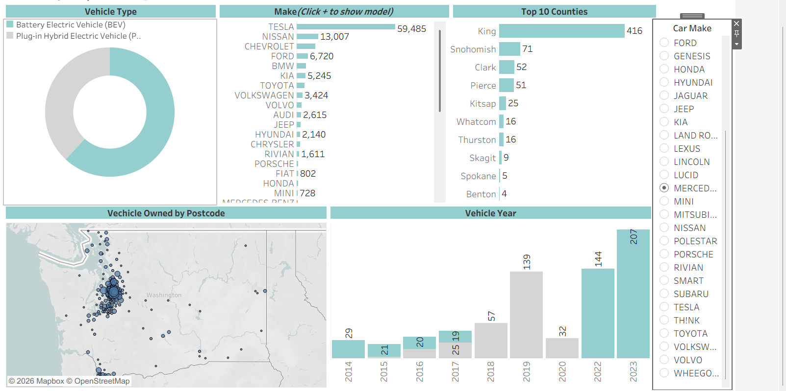
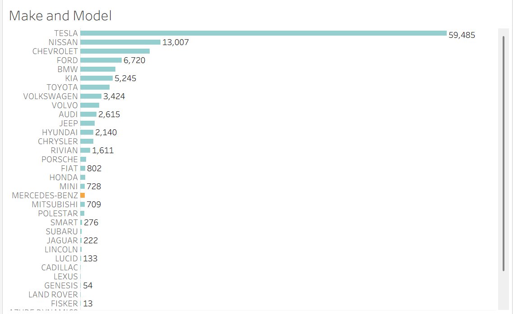
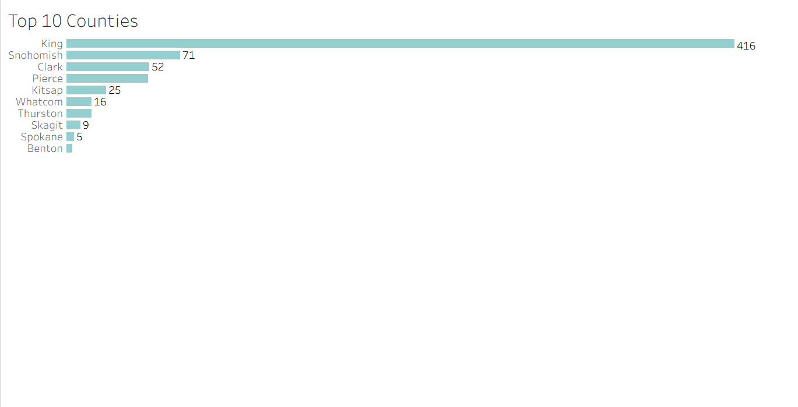
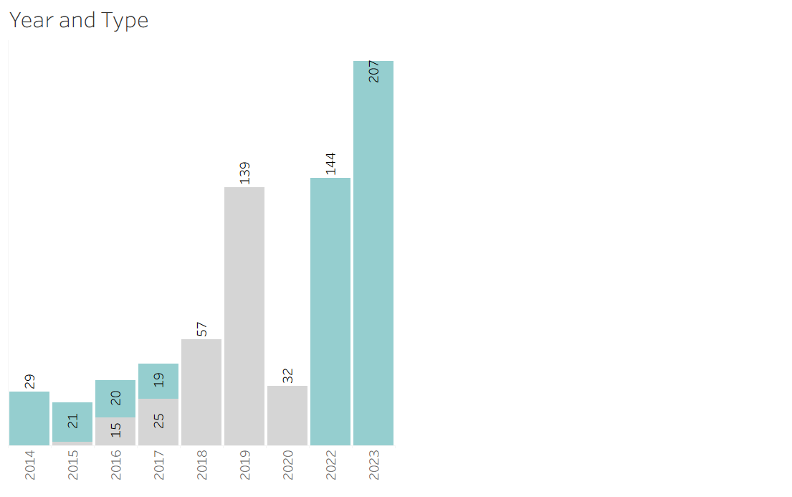

# 🚗 Electric Vehicle Tableau Dashboard

## 📌 Project Overview

This project presents an interactive Tableau dashboard that explores electric vehicle registration data. The dashboard provides insights into vehicle types, manufacturers, geographical distribution, and registration trends over time.

The dashboard allows users to filter data by vehicle manufacturer to better understand the distribution of electric vehicles.

---

## 📊 Dashboard Features

- Vehicle Type Distribution (BEV vs PHEV)
- Vehicle Make Analysis
- Top 10 Counties by Vehicle Registration
- Vehicle Registration Trend by Year
- Vehicle Distribution by Postcode (Map)
- Interactive Car Make Filter

---

## 🛠 Tools Used

- Tableau Desktop
- Tableau Maps

---

## 📁 Project Files

- `electric-vehicle-dashboard.twb` — Tableau workbook
- `screenshots/` — Dashboard screenshots
- `README.md` — Project documentation

---

## 📷 Dashboard Preview

### Dashboard Overview

---

### Vehicle Make Analysis

---

### Top 10 Counties

---

### Vehicle Registration by Year

---

## 📈 Key Insights

- Battery Electric Vehicles (BEVs) make up the majority of registered electric vehicles.
- Tesla has the highest number of registered vehicles.
- King County records the largest concentration of electric vehicles.
- Electric vehicle registrations have increased significantly in recent years.

---

## 👨‍💻 Author

**Ayomide Olatunji**

GitHub: https://github.com/ayomideolatunji-data

---

⭐ If you found this project interesting, feel free to star the repository!
