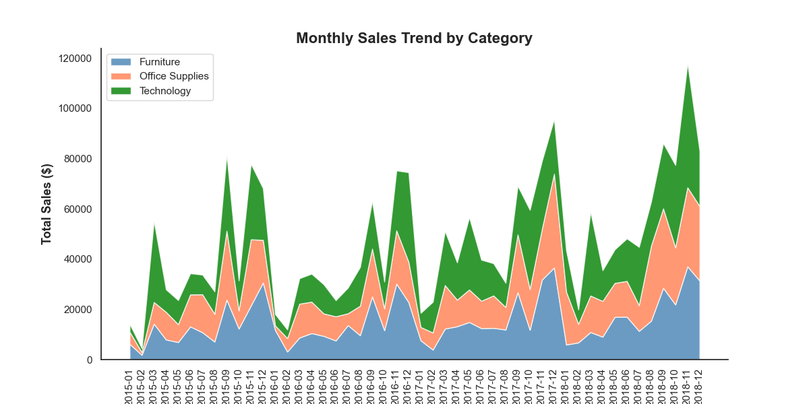
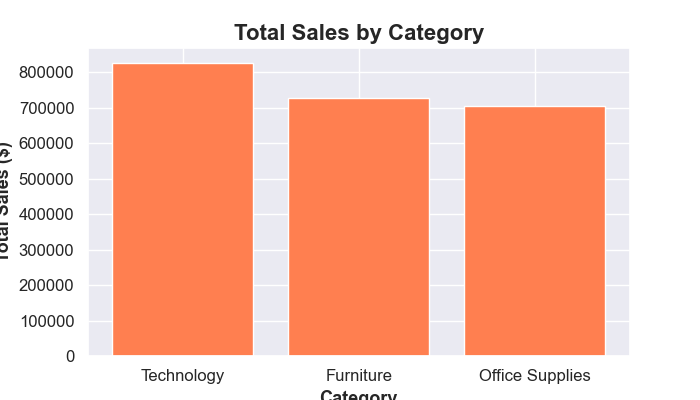
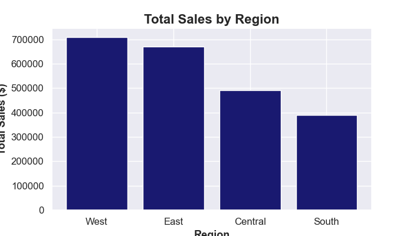
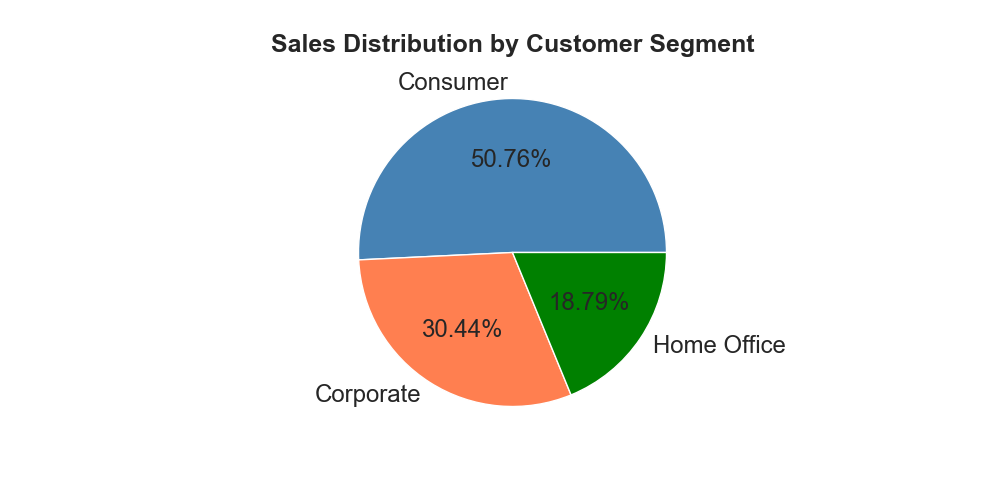

# 🛒 Superstore Sales Analysis with Python

## 📌 Project Overview

This project analyzes the **Superstore Sales** dataset using Python to uncover sales trends, customer purchasing behavior, and regional performance. The analysis demonstrates the complete data analysis workflow—from data exploration and cleaning to visualization and business insights.

---

## 🎯 Objectives

- Explore and understand the Superstore dataset.
- Clean and prepare the data for analysis.
- Identify sales trends across years.
- Analyze sales performance by customer segment, product category, and region.
- Visualize key findings to support business decision-making.

---

## 🛠️ Tools & Technologies

- Python
- Pandas
- Matplotlib
- Jupyter Notebook

---

## 📂 Dataset

This project uses the **Superstore Sales** dataset obtained from **Kaggle**. The dataset has been renamed to **`superstore-data.csv`** for clarity within this repository.

---

## 📊 Analysis Workflow

- Data Exploration
- Data Cleaning
- Data Filtering
- Data Sorting
- Data Aggregation & Grouping
- Exploratory Data Analysis (EDA)
- Data Visualization
- Business Insight Generation

---

## 📈 Key Findings

- **Consumer** customers contribute **50.76%** of total sales.
- **Technology** is the highest-performing product category.
- The **West** region generates the highest overall sales.
- Sales show a steady upward trend from **2015 to 2018**.

---

## 📷 Visualizations

### Sales Trend

### Sales by Category

### Sales by Region

### Sales by Segment

---

## 📁 Project Files

- `superstore-sales-analysis.ipynb` — Python analysis notebook
- `train.csv` — Dataset
- `screenshots/` — Project visualizations
- `README.md` — Project documentation

---

## 💡 Skills Demonstrated

- Data Cleaning
- Exploratory Data Analysis (EDA)
- Data Visualization
- Business Insight Generation
- Python Programming
- Pandas
- Matplotlib

---

## 👨‍💻 Author

**Ayomide Olatunji**

GitHub: https://github.com/ayomideolatunji-data

---

⭐ If you found this project interesting, feel free to explore the repository and connect with me.
